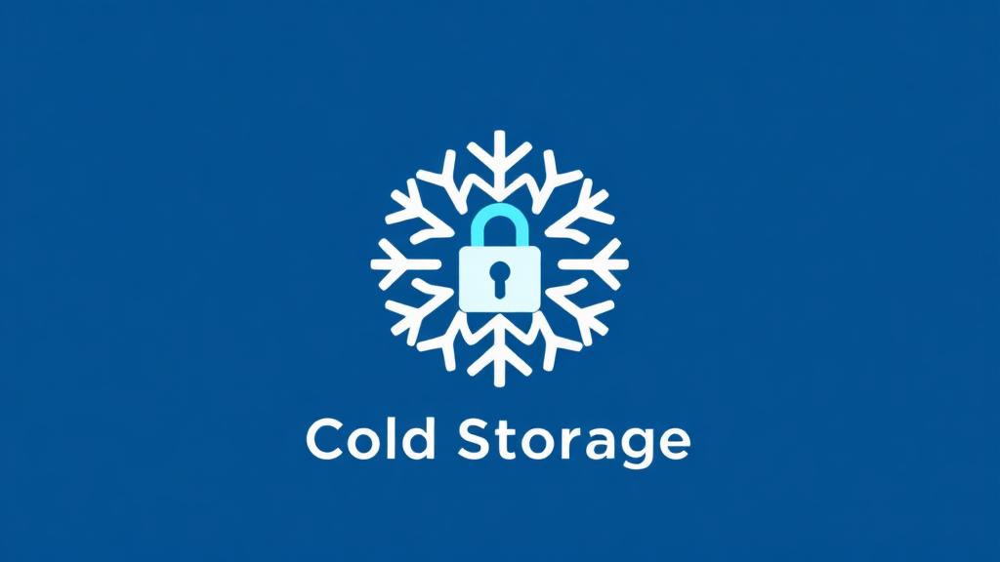

# 🔐 Frost Key Chain - Secure Cold Chain Tracker

A privacy-preserving cold chain temperature monitoring system built with **Fully Homomorphic Encryption (FHE)** using Zama's FHEVM protocol. Track temperature-sensitive cargo with end-to-end encryption while maintaining data privacy and integrity.

## 🌟 Features

- **FHE Key Storage**: Securely store encrypted keys with FHE and signature verification
- **Temperature Monitoring**: Track cold chain logistics with encrypted temperature data and warning alerts
- **FHE Counter**: Demonstrate basic FHE arithmetic operations with increment/decrement
- **Web3 Integration**: MetaMask wallet connection and multi-chain support
- **Modern UI**: Built with Next.js, TypeScript, and Tailwind CSS with responsive design
- **Security Features**: Input validation, access control, and comprehensive error handling

## 🎥 Demo

**🌐 Live Demo**: [https://frost-key-chain.vercel.app/](https://frost-key-chain.vercel.app/)

**📹 Video Demo**: [Watch demo.mp4](./demo.mp4)



## 🏗️ Architecture

### Smart Contracts

- **ColdChainTracker.sol**: Main contract for encrypted temperature recording
- **FrostKeyChain.sol**: Key management contract
- **FHECounter.sol**: Example FHE counter implementation

### Frontend Stack

- **Framework**: Next.js 15 with App Router
- **UI Library**: React 19
- **Styling**: TailwindCSS + Radix UI
- **Web3**: Wagmi + Viem + Ethers.js
- **FHE**: Zama FHEVM SDK
- **Wallet**: RainbowKit with MetaMask support

## 🚀 Quick Start

### Prerequisites

- **Node.js**: Version 20 or higher
- **pnpm**: Package manager (recommended)
- **MetaMask**: Browser wallet extension

### Installation

1. **Clone the repository**

   ```bash
   git clone https://github.com/PoppyLuke/frost-key-chain.git
   cd frost-key-chain
   ```

2. **Install dependencies**

   ```bash
   # Install root dependencies
   pnpm install

   # Install frontend dependencies
   cd frontend
   pnpm install
   ```

3. **Set up environment variables**

   ```bash
   # Set your mnemonic for deployment
   npx hardhat vars set MNEMONIC

   # Optional: Set Infura API key
   npx hardhat vars set INFURA_API_KEY

   # Optional: Set Etherscan API key for verification
   npx hardhat vars set ETHERSCAN_API_KEY
   ```

4. **Compile contracts**

   ```bash
   pnpm compile
   ```

5. **Run tests**

   ```bash
   pnpm test
   ```

### Local Development

1. **Start local Hardhat node**

   ```bash
   npx hardhat node
   ```

2. **Deploy contracts** (in a new terminal)

   ```bash
   npx hardhat deploy --network localhost
   ```

3. **Generate ABI files**

   ```bash
   cd frontend
   pnpm genabi
   ```

4. **Start frontend development server**

   ```bash
   cd frontend
   pnpm dev
   ```

5. **Open browser**

   Navigate to [http://localhost:3000](http://localhost:3000)

### Deploy to Sepolia Testnet

```bash
# Deploy contracts
npx hardhat deploy --network sepolia

# Verify on Etherscan
npx hardhat verify --network sepolia <CONTRACT_ADDRESS>

# Test on Sepolia
npx hardhat test --network sepolia
```

## 📁 Project Structure

```
frost-key-chain/
├── contracts/                      # Smart contracts
│   ├── ColdChainTracker.sol       # Main temperature tracking contract
│   ├── FrostKeyChain.sol          # Key management contract
│   └── FHECounter.sol             # Example FHE counter
├── deploy/                         # Deployment scripts
│   ├── deploy.ts                  # Main deployment script
│   └── 02_deploy_ColdChainTracker.ts
├── test/                          # Contract tests
│   ├── ColdChainTracker.ts        # ColdChainTracker tests
│   ├── FrostKeyChain.ts           # FrostKeyChain tests
│   └── *Sepolia.ts                # Sepolia network tests
├── frontend/                      # Next.js frontend application
│   ├── app/                       # Next.js app directory
│   │   ├── page.tsx              # Main page
│   │   ├── layout.tsx            # Root layout
│   │   └── providers.tsx         # Web3 providers
│   ├── components/               # React components
│   │   ├── Header.tsx            # Navigation header
│   │   ├── Footer.tsx            # Footer with dynamic year
│   │   ├── UploadSection.tsx     # Temperature upload form
│   │   ├── TemperatureTimeline.tsx # Temperature log display
│   │   └── StatsCards.tsx        # Statistics cards
│   ├── hooks/                    # Custom React hooks
│   │   ├── useColdChainTracker.tsx # Main contract hook
│   │   ├── useInMemoryStorage.tsx  # Storage hook
│   │   └── metamask/             # MetaMask integration
│   ├── fhevm/                    # FHEVM integration
│   │   ├── useFhevm.tsx          # FHEVM instance hook
│   │   └── internal/             # FHEVM internals
│   ├── abi/                      # Generated contract ABIs
│   └── public/                   # Static assets
├── hardhat.config.ts             # Hardhat configuration
├── package.json                  # Root dependencies
└── README.md                     # This file
```

## 🔧 Key Technologies

### Blockchain & Encryption

- **FHEVM**: Zama's Fully Homomorphic Encryption for EVM
- **Hardhat**: Ethereum development environment
- **Solidity**: Smart contract language

### Frontend

- **Next.js 15**: React framework with App Router
- **React 19**: Latest React with concurrent features
- **TailwindCSS**: Utility-first CSS framework
- **Radix UI**: Accessible component primitives
- **Lucide React**: Icon library

### Web3 Integration

- **Wagmi**: React hooks for Ethereum
- **Viem**: TypeScript Ethereum library
- **Ethers.js**: Ethereum wallet implementation
- **RainbowKit**: Wallet connection UI

## 📜 Available Scripts

### Root Directory

| Script             | Description                    |
| ------------------ | ------------------------------ |
| `pnpm compile`     | Compile all smart contracts    |
| `pnpm test`        | Run contract tests             |
| `pnpm coverage`    | Generate test coverage report  |
| `pnpm lint`        | Run linting checks             |
| `pnpm clean`       | Clean build artifacts          |

### Frontend Directory

| Script          | Description                   |
| --------------- | ----------------------------- |
| `pnpm dev`      | Start development server      |
| `pnpm build`    | Build for production          |
| `pnpm start`    | Start production server       |
| `pnpm lint`     | Run ESLint                    |
| `pnpm genabi`   | Generate ABI files            |

## 🔐 How It Works

### Temperature Recording Flow

1. **User Input**: User enters location, cargo, and temperature data
2. **Encryption**: Temperature is encrypted using FHEVM on the client side
3. **Signature**: User signs the transaction with their wallet
4. **Verification**: Smart contract verifies the signature
5. **Storage**: Encrypted temperature is stored on-chain
6. **Event**: Contract emits an event for frontend updates

### Temperature Offset System

To support negative temperatures with unsigned integers (euint64):

- **Offset**: +100°C added to all temperatures
- **Range**: -100°C to +100°C (stored as 0 to 2000)
- **Precision**: 0.1°C (multiply by 10)
- **Example**: -10°C → (−10 + 100) × 10 = 900

### Decryption Flow

1. **User Request**: User clicks "View Data" on a temperature log
2. **Signature**: User signs a decryption request
3. **FHEVM Decrypt**: FHEVM decrypts the encrypted value
4. **Reverse Offset**: Subtract 100°C and divide by 10
5. **Display**: Show original temperature to user

## 🧪 Testing

### Run All Tests

```bash
pnpm test
```

### Run Specific Test

```bash
npx hardhat test test/ColdChainTracker.ts
```

### Test Coverage

```bash
pnpm coverage
```

### Test on Sepolia

```bash
npx hardhat test --network sepolia test/ColdChainTrackerSepolia.ts
```

## 🚢 Deployment

### Local Network

```bash
# Terminal 1: Start node
npx hardhat node

# Terminal 2: Deploy
npx hardhat deploy --network localhost
```

### Sepolia Testnet

```bash
# Deploy
npx hardhat deploy --network sepolia

# Verify
npx hardhat verify --network sepolia <CONTRACT_ADDRESS>
```

### Frontend Deployment

The frontend is automatically deployed to Vercel on push to main branch.

**Live URL**: [https://frost-key-chain.vercel.app/](https://frost-key-chain.vercel.app/)

## 📚 Documentation

- [FHEVM Documentation](https://docs.zama.ai/fhevm)
- [Hardhat Documentation](https://hardhat.org/docs)
- [Next.js Documentation](https://nextjs.org/docs)
- [Wagmi Documentation](https://wagmi.sh)
- [RainbowKit Documentation](https://www.rainbowkit.com)

## 🤝 Contributing

Contributions are welcome! Please feel free to submit a Pull Request.

## 📄 License

This project is licensed under the BSD-3-Clause-Clear License. See the [LICENSE](LICENSE) file for details.

## 🆘 Support

- **GitHub Issues**: [Report bugs or request features](https://github.com/PoppyLuke/frost-key-chain/issues)
- **FHEVM Docs**: [https://docs.zama.ai](https://docs.zama.ai)
- **Zama Community**: [Discord](https://discord.gg/zama)

## 👥 Team

- **UI Development**: PoppyLuke
- **Smart Contracts**: VicChristie

---

**Built with ❤️ using Zama FHEVM**
